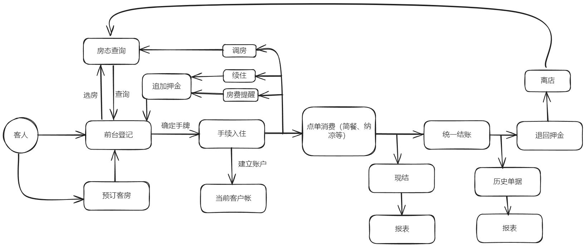
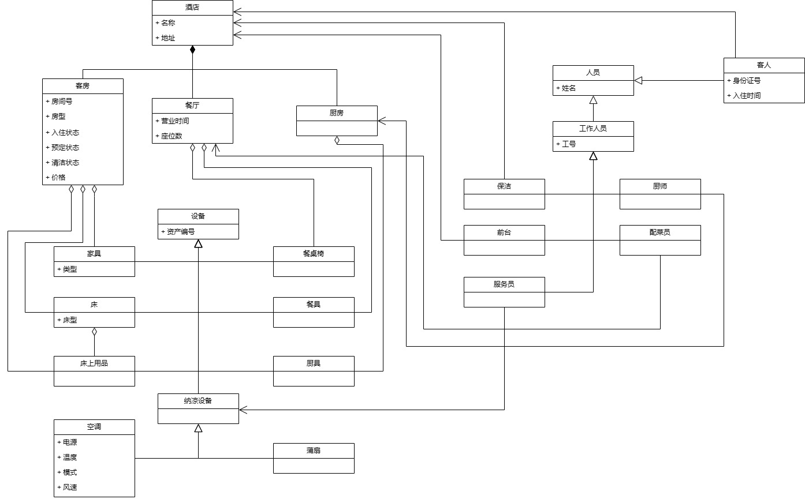
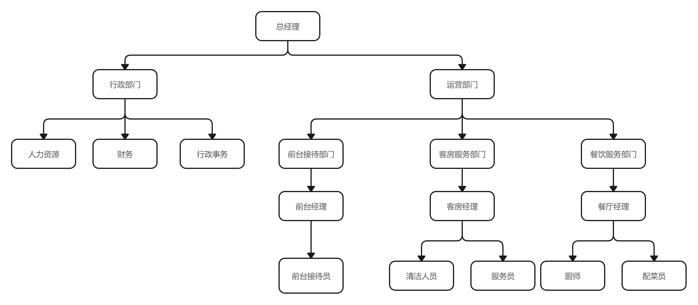

## 结合场景的需求分析

服务范围：包括住宿、简餐以及纳凉服务。
这些服务将满足对经济实惠而舒适的住宿需求，并提供基本的饮食和纳凉选择。

-   基本消费内容：住宿
-   增值服务：简餐、空调、服务员扇扇子

### 住宿服务

提供灵活的住宿时长选择，包括按小时和按天计费。客人可以根据需要选择不同的住宿方案。

1. 以小时为单位（最小 1 小时，最多 3 小时）
2. 以天为单位（最小一天，无上限）

消费者只有购买了住宿服务才可购买增值服务。
因为是廉价酒店，所以只有一种房型。房间数量有上限，当订房人数过多时，可能不能满足所有用户的需求。

### 增值服务

#### 简餐

提供简单的餐点选择，包括早餐、午餐和晚餐。食物种类和数量有限，但足以满足基本的饮食需求。

-   菜单服务：按食物种类、数量计费
-   供应管理：每天每种食品数量有上限，酒店工作人员可以在前一天录入每种菜品的供应量

#### 空调

按用电量计费，用电量由功率乘使用时间计算得出，功率由风速、温度两个变量结合以下公式计算得出：
$$P=\lambda\times \lvert T_{tar}-T_{now}\rvert + \alpha\times2000$$
其中 $P$ 为功率，$\lambda$ 为风速系数，$T_{tar}$ 为目标温度，$T_{now}$ 为当前温度，$\alpha$ 为模式控制系数。
同一时间内整个酒店所有房间空调功率有上限，出现竞争的情况下按照 FIFO 方式调度。

-   控制：用户自主调节房间内空调
-   调度：有使用功率的硬性限制，多个房间竞争有限的空调功率资源时进行调度
-   计费：可以导出每个房间使用空调的详单并根据规则自动计算价格

##### 详单

- 内容：列举从上次结算到当前时间的所有使用空调记录。每段记录包括开始时间、结束时间、功率、费用（包含计算公式）以及总费用，如果存在竞争的情况下还包括调度时间。
- 产生时间：
  - 用户主动查询
  - 用户退房时
  - 每天晚上 12 点
  - 系统自动调度时
  - 用户切换空调模式时（如从制冷模式切换到制热模式、关闭空调、调整风速等）
  - 空调达到目标温度时

#### 人工纳凉

按时长和每分钟扇扇子次数计费，计算公式类似上面。

:::note
与空调不同的是，人工服务出现竞争的情况下按照已消费额度的优先级调度。
:::

## 设计

### 领域模型驱动的架构设计

#### 客户端

1. 用户终端：可以进行房间预定，空调控制，点餐操作。
2. 前台终端：接受房间预定并分配房间。提前一天填写第二天菜单，用户点餐后收到提醒。
   客人 checkout 时能够按照房间号查询入住期间的消费以及详单。
3. 控制后台：有最高权限，可以查看、修改所有信息，可以显示统计信息和日志信息。

#### 逻辑层

> 事件发生后进行处理的业务逻辑

-   系统能够在接收到房间预定后自动安排房间，采用客人入住尽可能最稀疏的分配方式。
-   用户控制空调温度和风速，如果当前修改发生后空调功率超过上限，则将当前修改入队，
    依次满足需求。
-   用户点餐后，系统判断该食物是否有剩余，如果有，通知前台工作人员准备食物，
    如果没有，则通知用户该菜品售罄。

依据以上分析，绘制业务流程图如下：

#### 领域层

> 数据对象

- 空调：功率消耗由温度和风速共同构成，酒店整体空调功率有上限。
- 食物：每天酒店供应食物种类和数量有限制，不同种类的食物一份价格不同。
- 房间：酒店房间数有上限，每间房只能住一个客人。
- 日志：一个客人入住一个房间期间所进行的所有消费的记录，包括时间和项目，用于计费。
- 客人：入住同一间房间，共同在酒店消费的一个或多个人组成一个客人对象。
- 员工：负责填写食物存储信息，接收点餐请求，结账时导出计费信息及详单。

依据以上分析，绘制业务背景UML类图如下：

绘制人力资源架构图如下：

